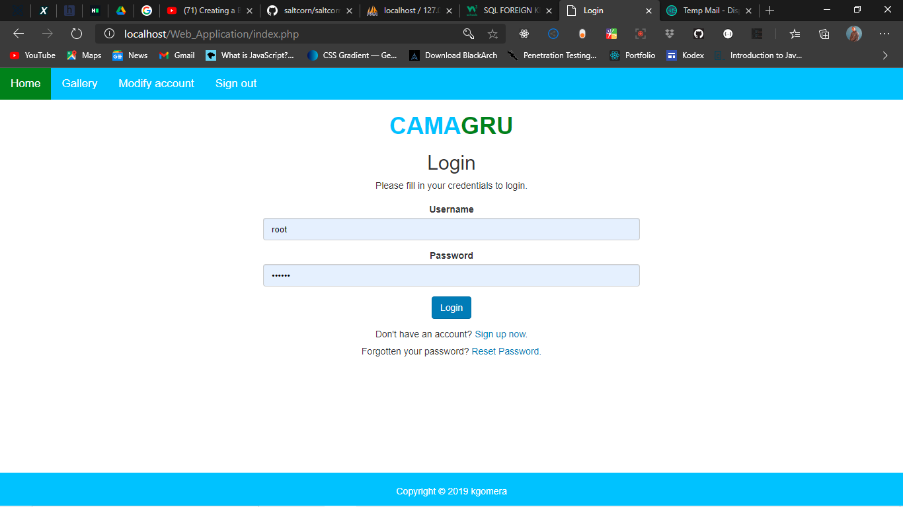
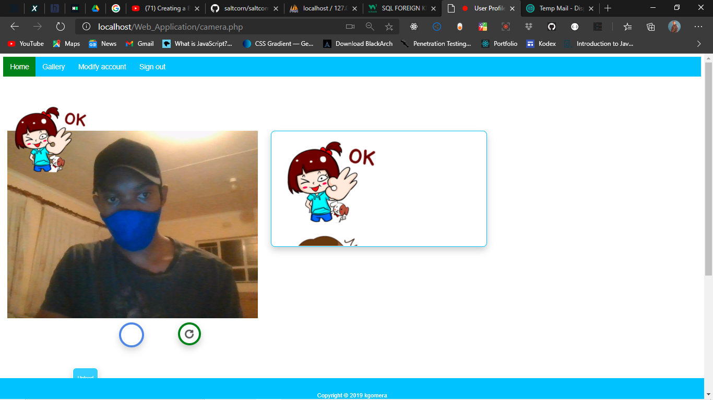

# Camagru

Camagru is an Instagram-like website. It allows you to take pictures with your webcam or upload one, and add beautiful filters on it.

It is the first Web Project of the school 42.

# installation

- git clone https://github.com/KudzanaiGomera/Camagru

- cd Camagru

- cut the folder Web_Application and paste it into your xampp/htdocs

- start your apache and mysql server

-  open Web_Application in your text editor of choice

- then navigate to the Web browser and visit 

- https://localhost

- incase you receive db connection error make sure the connection correspond to your local server

Go to :

Web_Application and it will automatically create and load the database and display the landing page

Enjoy!

# Contraints
no constrains

# Website overview coming up soon

